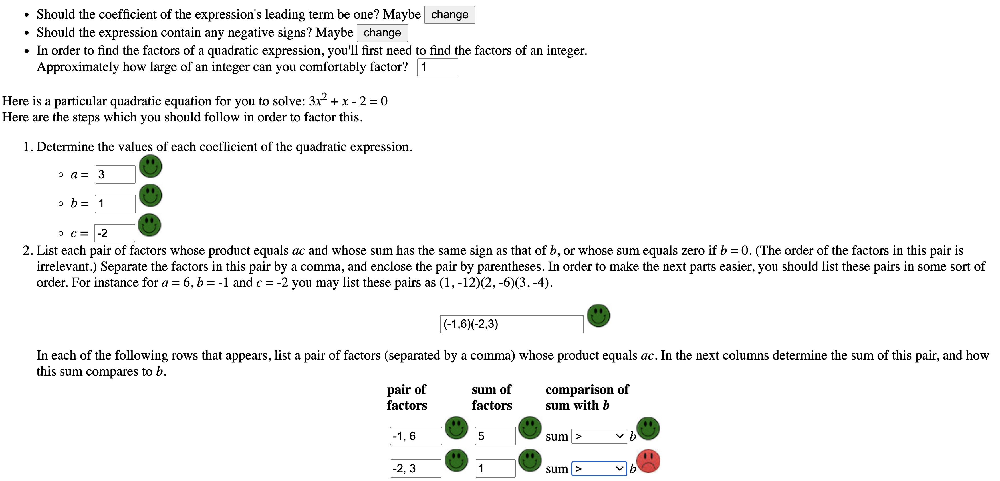
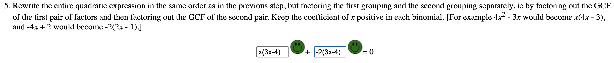

[Heroku deployment](https://quadratic-factorizer.herokuapp.com)

This front-end project was built from a [quick start](https://github.com/mars/create-react-app-buildpack#user-content-quick-start) for a create-react-app.
It provides practice for an algebra student in the solving of quadratic equations via
standard approaches for [factoring](https://brilliant.org/wiki/factoring-quadratics/) trinomials with integer coefficients.
The app's calculations are done with JavaScript, and the page is rendered with two React
functional components which utilize hooks.

Solving a quadratic equation (e.g., 2<i>x</i><sup>2</sup> - 3<i>x</i> + 1 = 0) in this manner requires approximately 6 steps or 9 steps, depending upon whether or not the coefficient of the <i>x</i><sup>2</sup> term equals one.  The user controls the difficulty of the factoring task by the way in which he/she answers the first three questions. The app then randomly generates a quadratic equation which loosely fits those specifications, subject to a bit of randomization.

The app subsequently guides the user through the procedure's steps one at a time, and the numerical value of the step is kept in state.  For each step there are three quantities also stored in state: the answer key(s), the user's response(s), and the grade(s) for the user's response(s).  When the app grades string-responses such as algebraic expressions, it attempts to anticipate all possible ways that the user may format a "correct" response.  Often the student's response(s) in step <i>n</i> is/are used to generate the answer(s) for step <i>n</i>+1.  For each step there is a useEffect which typically handles the grading of the user's answer for that particular part, the calculation of the answer key(s) for later parts, and (if appropriate) the incrementation of the step variable.

As an example, this screenshot is for (successfully completed) step-5 of the app:


This part is withheld from the user until he/she has correctly completed the previous step.
The snippet below contains jsx for the instructions and controlled inputs for the portion of the page depicted above.

```
{step < 5 || a === 1 ? null : <li>
    Rewrite the entire quadratic expression in the same order as in the previous step, but factoring the first grouand the second grouping separately, ie by factoring out the GCF of the first pair of factors and then factoringthe GCF of the second pair. Keep the coefficient of <i>x</i> positive in each binomial.  [For example 4<i><sup>2</sup> - 3<i>x</i> would become <i>x</i>(4<i>x</i> - 3), and -4<i>x</i> + 2 would become -2(2<i>x</i> - 1).]
    <p align="center">
        <input className={"medium"} type={"text"} value={subStringResponse[0]} onChange={e => {
            let newSubStringResponse = [...subStringResponse];
            newSubStringResponse[0] = e.target.value;
            setSubStringResponse(newSubStringResponse);
        }} />
        <Mark grade={subStringGrade[0]} />
        + <input className={"medium"} type={"text"} value={subStringResponse[1]} onChange={e => {
            let newSubStringResponse = [...subStringResponse];
            newSubStringResponse[1] = e.target.value;
            setSubStringResponse(newSubStringResponse);
        }} />
        <Mark grade={subStringGrade[1]} />
        = 0
    </p>
</li>}
```

The code snippet below is the useEffect responsible for the grading of the user's responses for step-5.
```
const ue5 = () => {
    let newSubStringResponse = [...subStringResponse];
    let newSubStringGrade = [...subStringGrade]
    let bothCorrect = true;
    for (let i = 0; i < newSubStringGrade.length; i++) {
        newSubStringGrade[i] = (newSubStringResponse[i] === '') ? null :
            newSubStringResponse[i] === subString[i];
        bothCorrect = bothCorrect && newSubStringGrade[i];
    }
    setSubStringGrade(newSubStringGrade);
    if (bothCorrect) setStep(6);
}
useEffect(ue5, [subStringResponse, subString])
```

The one-to-one correspondence between step, answer key, user response, grade, useEffect, and input makes the code very maintainable and scalable, and this pattern should work quite well for any other sequential learning-exercise.
